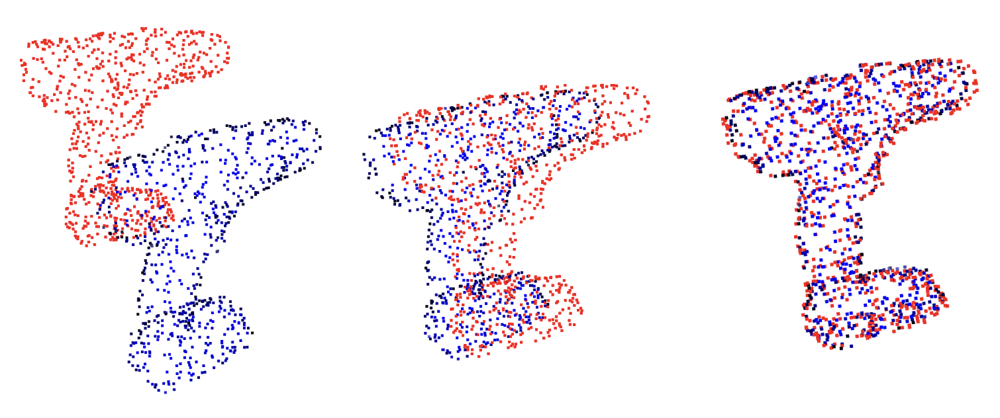
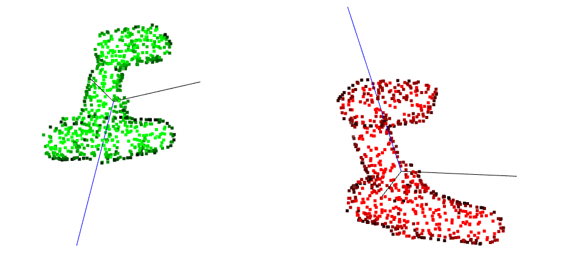
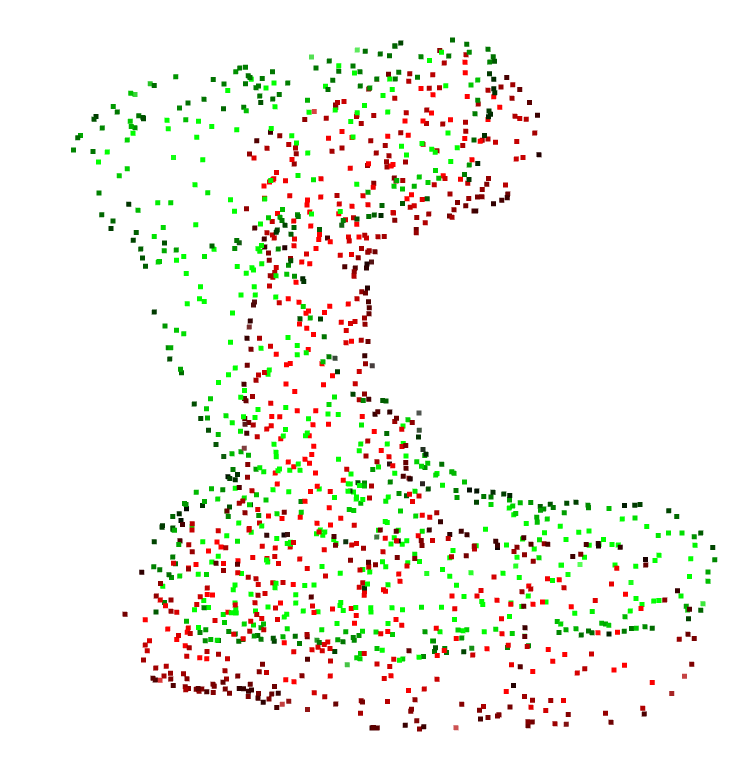
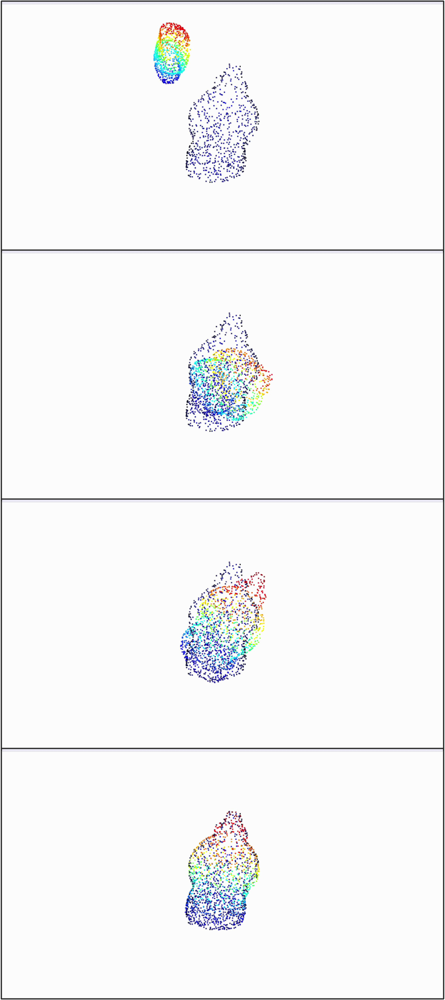

# 3D Object Localization Using Signed Distance Fields

Accurately localizing objects in three-dimensional space is a foundational challenge in robotics, enabling tasks like perception, manipulation, and navigation. This repository presents a novel approach to object localization using a **Signed Distance Field (SDF)** representation of the target object. Our method leverages geometric cues from the SDF to align the object's 3D point cloud with the SDF surface, enabling robust 6-DOF pose estimation for various object types.

## Overview
This repository implements the proposed SDF-based localization pipeline, consisting of:
- **Principal axis-based initialization**: Aligns centroids and principal axes of the point clouds.
- **Gradient-based optimization**: Minimizes a combined geometric and normal alignment loss to find the final rotation and translation.

The method is tested on objects from the YCB dataset for both complete and partial views.

---

### Example Results

#### 1. Localization Example
SDF-based localization of a drill:  
The scene point cloud (red) is fit to the inertial Signed Distance Field (SDF) frame (blue), visualized as a point cloud, producing the object's 6-DOF pose.

#### 2. PCA-Based Initialization
Principal axes alignment brings the object closer to the ground truth, reducing the risk of local minima during optimization.

**Before PCA Initialization**:  

**After PCA Initialization**:

#### 3. Gradient-Based Optimization
Localization of a mustard bottle using gradient-based optimization:  

  

The localization converged within ~100 iterations.

---

### Results

#### Established Metrics

1. **Rotation Error ($R_{err}$):**
   - Measures the angular difference between the ground truth rotation and the estimated rotation. 
   - Specifically, $R_{err}$ is computed as the deviation of their product from the identity:
     $$R_{err} = \|I - R_{est}R_{gt}\|_2$$
   - It is reported in degrees and quantifies how accurately the object's orientation is recovered.

2. **Translation Error ($t_{err}$):**
   - Represents the Euclidean distance between the ground truth translation vector ($t_{gt}$) and the estimated translation vector ($t_{est}$):
     $$t_{err} = \|t_{gt} - t_{est}\|_2$$
   - This measures how close the predicted object position is to the actual position in the 3D scene. It is reported in the same units as the point cloud (e.g., meters).

3. **Average Distance (ADD):**
   - Evaluates the overall alignment between the object model and the scene by averaging the point-to-point distances between the transformed model and the ground truth:
     ADD = (1 / N) Σ || (R_est p_i + t_est) - (R_gt p_i + t_gt) ||_2
   - Here, $N$ is the total number of points in the model, and $\mathbf{p}_i$ represents the points in the object model. This metric accounts for both rotation and translation errors and is widely used for pose estimation tasks.

#### Metrics for YCB Objects (Complete Views)
| Metric                          | Power Drill | Banana  | Mustard Bottle | Bowl    | Cracker Box | Hammer  | Mug     | Wrench  |
|---------------------------------|-------------|---------|----------------|---------|-------------|---------|---------|---------|
| **Rotation Error ($R_{err}$)** ↓ | 0.0059      | 0.0101  | 0.2283         | 1.0605  | 0.2326      | 0.0054  | 0.0467  | 0.0328  |
| **Translation Error ($t_{err}$)** ↓ | 0.0001      | 0.0002  | 0.0001         | 0.0022  | 0.0001      | 0.0001  | 0.0003  | 0.0006  |
| **Average Distance (ADD)** ↓     | 0.00124     | 0.00083 | 0.00111        | 0.03342 | 0.00205     | 0.00125 | 0.00186 | 0.01611 |

#### Metrics for YCB Objects (Partial Views)
| Metric                          | Power Drill | Banana  | Mustard Bottle | Bowl    | Cracker Box | Hammer  | Mug     | Wrench  |
|---------------------------------|-------------|---------|----------------|---------|-------------|---------|---------|---------|
| **Rotation Error ($R_{err}$)** ↓ | 2.8105      | 0.1587  | 2.8274         | 1.9520  | 0.3934      | 0.0230  | 0.1264  | 1.1413  |
| **Translation Error ($t_{err}$)** ↓ | 0.0110      | 0.0093  | 0.0176         | 0.0141  | 0.0294      | 0.0073  | 0.0174  | 0.0051  |
| **Average Distance (ADD)** ↓     | 0.01433     | 0.0069  | 0.01622        | 0.02232 | 0.0280      | 0.00749 | 0.01168 | 0.00469 |

---

### Usage
All SDF localization functionality is encapsulated within the `SDFLocalizer` class in `sdf_localizer.py`. To run a test, simply execute `sdf_localizer.py` which has an examples script in the `__main__()` method. You will require:
- Python 3.8+
- [Pytorch Volumetric (for SDF queries)](https://github.com/UM-ARM-Lab/pytorch_volumetric)
- PyTorch, NumPy, SciPy, sklearn, open3d, matplotlib

